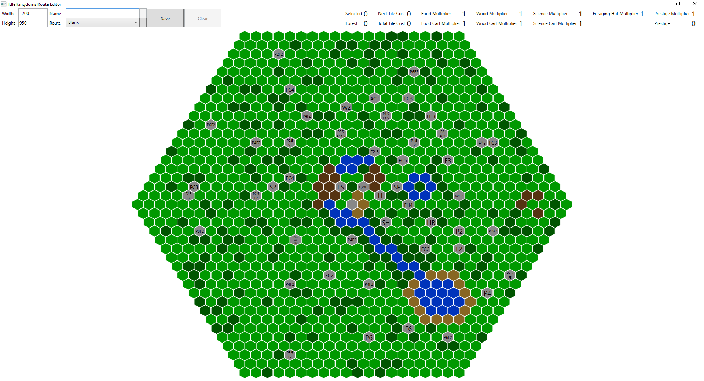

IdleKingdomsEditor
==================

Simple editor to play around with routes

v0.4.8
======

With this update shrines have a chance to move 1 space. Grass has a chance to turn to forest and vice versa. So the routing is largely the same, depending on luck a given route could change in your favour or might work against you.

I will update the editor so you can easily edit the underlying map

Usage
-----

This editor is **windows only**

Download the latest release from [here](https://github.com/rrs/IdleKingdomsEditor/releases) unzip it and run IdleKingdomsEditor.exe, built using [AppVeyor](https://ci.appveyor.com/project/rrs/idlekingdomseditor)

Please see the [wiki](https://github.com/rrs/IdleKingdomsEditor/wiki) for further help.

Controls
--------

* **\+** adds a new route the the list of managed routes, using current width, height, selected tiles and the given name.
* **\-** removes the currently selected route from the list of managed routes
* **Save** saves the managed routes to disk, see [wiki](https://github.com/rrs/IdleKingdomsEditor/wiki/Saved-Rotues) for more info
* **Clear** clears all nodes from the current route

The overlay shows what bonuses the last selected tiles has, if any

Blank Map
---------

Selected Route
--------------

Thanks
------
Thanks to https://github.com/AlexanderSharykin/HexGrid for the hex control repo i forked