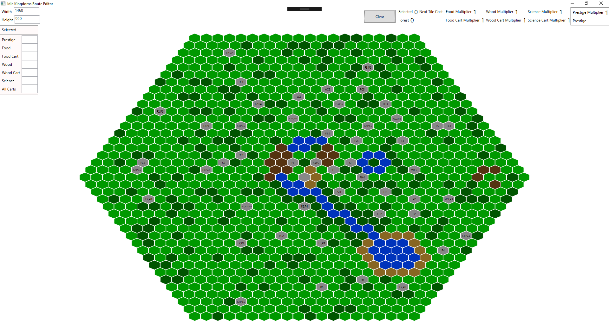
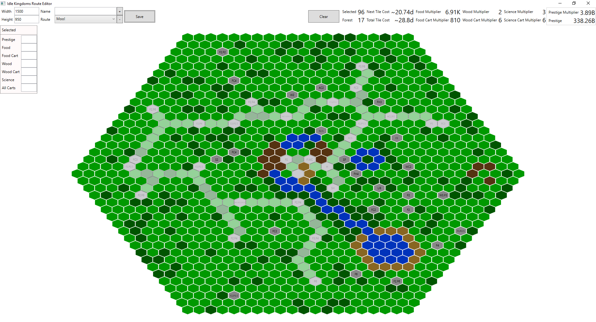

IdleKingdomsEditor
==================

Simple editor to play around with routes

build folder contains the build output of the IdleKingdomdsEditor project

Controls
--------

* **\+** adds a new route the the list of managed routes, using current width, height, selected tiles and the given name.
* **\-** removes the currently selected route from the list of managed routes
* **Save** saves the managed routes to disk
* **Clear** clears all nodes from the current route

The overlay shows what bonuses the last selected tiles has, if any

Blank Map
---------

Selected Route
--------------

